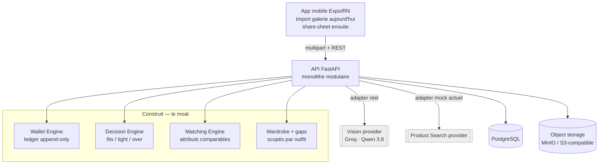

# Fashion Money
### Décider quoi acheter selon son budget, sa garde-robe et son style


> Une couche de décision posée sur le shopping mode : à partir d'une inspiration réelle, Fashion Money comprend les looks visibles, les compare à la garde-robe, identifie ce qu'il manque et mesure l'impact budgétaire avant l'achat.

| Statut | Stack | Rôle | Période |
|---|---|---|---|
| Wedge backend/mobile fonctionnel · Vision réelle validée · Product Search encore mocké | FastAPI · PostgreSQL · Alembic · MinIO/S3 · Expo/RN · Groq | Conception & développement | Août 2026 → |

---

## Le problème

On tombe en permanence sur des tenues qui plaisent — pendant un scroll TikTok ou Instagram, dans une capture d'écran ou une photo — et on achète souvent sans relier trois informations : **ce que l'on possède déjà, ce qu'il manque vraiment, et ce que le budget du mois permet encore**.

Les apps de garde-robe savent organiser les vêtements. Les apps de budget savent suivre une enveloppe. Les moteurs de recherche visuelle savent retrouver des produits. Fashion Money cherche à relier ces trois mondes **au moment de la décision d'achat**.

La question centrale n'est donc pas seulement « est-ce que ce look me plaît ? », mais :

> **« Qu'est-ce que je dois réellement acheter pour recréer ce look, et est-ce une bonne décision avec mon budget actuel ? »**

Le positionnement reste : **budget-first pour le moat, capture-first pour l'usage**.

## Boucle produit cible

```text
Capture / inspiration
        ↓
Vision / décomposition du look
        ↓
Sélection du look si plusieurs outfits
        ↓
Matching avec la garde-robe
        ↓
Gaps : pièces réellement manquantes
        ↓
Product Search réel
        ↓
Quelques options achetables pertinentes
        ↓
Impact sur le budget AVANT achat
        ↓
Décision : acheter / attendre / substituer / étaler
        ↓
Confirmation d'achat
        ↓
Wallet + garde-robe mis à jour
        ↓
Valeur cumulative à la capture suivante
```

Deux régimes structurent la proposition de valeur :

- **J0 / penderie vide** — le premier « wow » est financier : combien coûte le look, est-ce qu'il rentre dans l'enveloppe, faut-il l'étaler ou le substituer ?
- **Utilisateur mature** — le « wow » devient vestimentaire : l'app sait déjà ce qui est possédé et peut réduire le look aux quelques pièces réellement manquantes.

L'écran central reste la **décision budgétaire**, qui affiche le solde après achat avant l'action.

## État réel du produit

Fashion Money a dépassé le walking skeleton mocké initial.

Déjà implémenté :

- Wallet Engine avec ledger append-only, rollover et idempotence ;
- Decision Engine `fits | tight | over` ;
- confirmation d'achat atomique ;
- garde-robe persistée ;
- matching attribut-based explicable ;
- analytics H1–H4 / J0 vs mature / compounding ;
- application mobile Expo/React Native ;
- import réel depuis la galerie ;
- upload réel de l'image vers object storage S3-compatible / MinIO ;
- provider Vision réel ;
- Groq comme provider local de développement ;
- Qwen 3.8 comme baseline Vision validée ;
- contrat collage-aware `outfits[]` ;
- persistance de tous les outfits et de leurs pièces ;
- normalisation `category_raw → category` ;
- matching et gaps scopés par outfit ;
- gestion des attributs Vision inconnus sans les compter automatiquement comme désaccords.

Encore mocké ou hors scope actuel :

- Product Search réel ;
- checkout universel ;
- share-sheet TikTok/Instagram ;
- automatisation des reçus/emails ;
- moteur intelligent de phasing/substitution ;
- Digital Me / avatar / Virtual Try-On.

## Architecture

Monolithe modulaire, ports & adapters. On **construit le moat** — Wallet, Matching, Decision, données de garde-robe — et on place les commodités externes derrière des providers remplaçables.



### Contrat Vision actuel

Les collages ne sont plus aplatis dans une pseudo-tenue unique :

```text
image_type
style
dominant_palette[]
outfits[]
    style
    pieces[]
        category_raw
        category
        color
        cut
        material
        swatch
        confidence
representative_outfit_index
```

Les outfits sont tous persistés. Le backend conserve un outfit représentatif pour la compatibilité du slice actuel, mais la suite produit prévoit une sélection explicite : **« Quel look veux-tu recréer ? »**.

## Vision réelle : gate atteint

Le smoke test de référence utilise quatre collages de styles différents.

Avec `qwen/qwen3.8-27b` :

```text
images_attempted  = 4
images_succeeded  = 4
images_failed     = 0
success_ratio     = 1.0
collages_detected = 4
avg_outfit_count  = 4.5
avg_pieces/outfit = 2.78
missing_material_ratio = 0.76
```

Le dernier point est volontairement positif : le modèle laisse une matière inconnue à `null` plutôt que d'inventer systématiquement du coton, du lin ou du cuir.

Un défaut connu subsiste : certains collages peuvent produire un **ghost outfit** à une seule pièce. Le backend évite déjà de sélectionner ce type d'outfit comme représentant lorsqu'un outfit plus riche existe ; l'UX de sélection multi-outfit sera la réponse produit principale.

Voir [`docs/vision-smoke-test.md`](docs/vision-smoke-test.md) pour le protocole et [`rapport.md`](rapport.md) pour l'historique complet.

## Matching

Le matching reste volontairement explicable avant d'envisager des embeddings.

Poids métier :

```text
category = 40
color    = 25
cut      = 20
material = 15
```

Le score `owned_pct` est désormais **normalisé sur les attributs réellement comparables** entre la pièce Vision et la pièce de garde-robe. Un attribut `null` n'est donc pas automatiquement un désaccord.

Deux garde-fous s'appliquent :

- un minimum d'évidence comparable est requis avant de déclarer une pièce possédée ;
- en cas de candidats concurrents, le ranking favorise d'abord l'éligibilité à l'ownership puis la quantité d'évidence réellement matched, afin de ne pas préférer mécaniquement une pièce vague à une pièce mieux décrite.

Ce changement de sémantique est consigné dans [`docs/decisions-applied.md`](docs/decisions-applied.md).

## Modèle de données

Le wallet est un **ledger append-only** : chaque mouvement (`SPEND`, `ADJUST`, `ROLLOVER_IN`) est une ligne immuable et le solde est dérivé.

```text
available = base + Σ ROLLOVER_IN − Σ SPEND + Σ ADJUST
```

Côté Vision, les données sont désormais persistées en trois niveaux :

```text
Look
  └── LookOutfit[]
        └── LookPiece[]
```

`LookPiece` conserve notamment `outfit_id`, `category_raw`, la catégorie normalisée et `confidence`.

Schéma détaillé : [`docs/technical-design-v1.md`](docs/technical-design-v1.md).

## Installation / lancement

```bash
docker compose up --build
curl localhost:8000/health
```

Services locaux principaux :

- API FastAPI : `:8000` ;
- PostgreSQL ;
- MinIO pour les captures ;
- migrations Alembic au démarrage selon le workflow local.

Pour le provider Vision réel, les secrets restent uniquement dans `backend/.env` et ne sont jamais commités.

Exemple :

```text
DECOMPOSITION_PROVIDER=groq
GROQ_API_KEY=<secret local>
VISION_MODEL=qwen/qwen3.8-27b
```

## Tests / qualité

La CI vérifie actuellement :

```text
pytest
ruff check
mypy
npx tsc --noEmit   # mobile
```

Le smoke test Vision réel est volontairement séparé de la CI car il dépend d'une clé provider et de captures locales non versionnées.

## Roadmap immédiate

1. **Finaliser / merger le jalon Vision collage-aware.**
2. **Sélection multi-outfit mobile** — « Quel look veux-tu recréer ? ».
3. **Product Search réel** — remplacer le provider mocké par de vrais produits achetables.
4. **PurchaseScore réel** — pertinence produit + budget + doublons garde-robe + fraîcheur/stock.
5. **Garde-robe mobile complète** — ajout, modification, suppression, import facilité.
6. **Wishlist budget-aware + alertes**.
7. **Phasing / substitution intelligents**.
8. **Share-sheet TikTok / Instagram**.
9. **Enrichissement automatique de la garde-robe via reçus / confirmations d'achat**.
10. **Profil de style et tenue du jour**.
11. **Digital Me / Avatar / Virtual Try-On** — avatar personnalisable puis rendu 2D à partir de photos utilisateur, sans rendre les photos obligatoires.

Le prochain gros mur technique est désormais :

> **Vision → outfit sélectionné → pièce manquante → vrais produits achetables → impact budgétaire.**

## Documentation

- [`rapport.md`](rapport.md) — état global, historique des PR, roadmap et idées futures.
- [`docs/PRD-v1.md`](docs/PRD-v1.md) — spécifications pilotées par H1–H4.
- [`docs/technical-design-v1.md`](docs/technical-design-v1.md) — architecture et contrats techniques.
- [`docs/vertical-slice-1.md`](docs/vertical-slice-1.md) — backlog d'implémentation historique du premier slice.
- [`docs/vision-smoke-test.md`](docs/vision-smoke-test.md) — protocole de benchmark Vision réel.
- [`docs/wave-b-analytics.md`](docs/wave-b-analytics.md) — instrumentation des hypothèses et du compounding.
- [`docs/decisions-applied.md`](docs/decisions-applied.md) — décisions et invariants techniques appliqués.

Documents encore à consolider/créer au fil des prochains jalons : `docs/ARCHITECTURE.md`, `docs/DATA_MODEL.md`, `docs/DECISIONS.md`, `docs/TESTING.md`, `docs/ROADMAP.md` et `CHANGELOG.md`.
