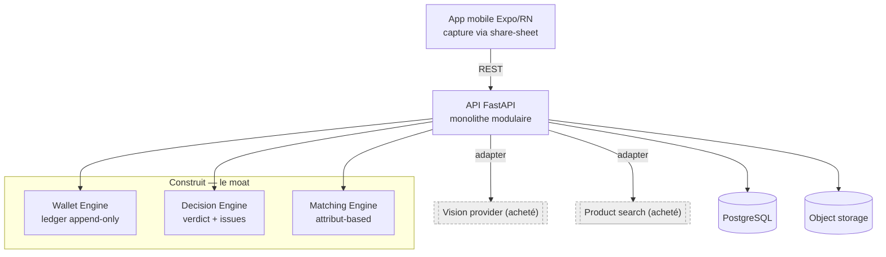

# Fashion Money
### Décider quoi acheter selon son budget, pas seulement selon son style


-success)


> Une couche financière posée sur la garde-robe : au moment de craquer sur un look, l'app dit ce qu'on possède déjà, ce qu'il manque, et si ça tient dans le budget du mois.

| Statut | Stack | Rôle | Période |
|---|---|---|---|
| Conception → développement · slice VS-01→05 livré & testé (le produit reste au stade validation du wedge) | FastAPI · PostgreSQL · Alembic · Expo/RN | Conception & développement (solo) | Août 2026 → |

---

## Le problème

On tombe en permanence sur des tenues qui plaisent — un scroll TikTok ou Instagram, une capture d'écran — et on achète à l'aveugle. On ne sait pas ce qu'on possède déjà de proche, ni ce qu'il faudrait vraiment ajouter, ni si la dépense reste raisonnable ce mois-ci.

Les applications existantes ratent la moitié du problème. Les apps de garde-robe regardent les dépenses *passées* (coût par port) ; les apps de budget savent gérer une enveloppe mensuelle mais ne connaissent rien aux vêtements. Personne ne réunit les deux **au moment de la décision d'achat**.

Fashion Money comble ce trou. Sa question n'est pas « est-ce que c'est joli ? » mais **« est-ce un bon achat, vu mon budget du mois et ce que je possède déjà ? »**. Le budget est le cœur du produit ; l'inspiration n'est que le déclencheur.

## Ce que fait le système

La boucle : `capture → décomposition du look → ce que je possède déjà → ce qu'il manque → options achetables → décision budgétaire → confirmation → mise à jour du budget et de la garde-robe`.

Deux régimes du même produit :
- **J0 (garde-robe vide)** — le moment fort est *financier* : reproduire le look coûte X, le budget en autorise Y, voici comment l'étaler ou une version qui rentre.
- **Utilisateur mature** — le moment fort est *vestimentaire* : « tu possèdes déjà 75 %, il ne te manque qu'une pièce, elle rentre ».

L'écran central est celui de la décision : il affiche le **solde après achat avant l'action**, avec un verdict clair — *ça passe · juste, mais ça passe · ça déborde*.

## Architecture

Monolithe modulaire, ports & adapters. On **construit le moat** (Wallet, Decision, Matching) et on **achète la commodité** (vision, recherche produit) derrière des providers interchangeables.



## Modèle de données

Le wallet est un **ledger append-only** : chaque mouvement (`SPEND` · `ADJUST` · `ROLLOVER_IN`) est une ligne immuable, et le solde est *dérivé*, jamais stocké :

```
available = base + Σ ROLLOVER_IN − Σ SPEND + Σ ADJUST   (sur la période)
```

Schéma complet (garde-robe, captures/looks/pièces, matches, options, décisions, achats) : voir [`docs/technical-design-v1.md`](docs/technical-design-v1.md) §4.

## Décisions importantes

Chaque décision porte son compromis assumé.

- **Budget-first plutôt que styling-first.** C'est le seul angle encore libre en 2026 (les apps de garde-robe et la recherche visuelle sont déjà occupées). *Compromis :* on cible des gens qui achètent *moins*, ce qui met l'affiliation — le modèle par défaut du secteur — en tension avec la promesse. La monétisation visera donc l'abonnement.
- **Wallet en ledger append-only** plutôt qu'un champ `solde` modifié en place. *Compromis :* plus de lignes écrites et un calcul à la lecture, contre un solde auditable et un report mensuel déterministe, rejouable après incident.
- **`/decisions/evaluate` sans effet de bord ; seule `/purchases/confirm` mute.** *Compromis :* deux endpoints au lieu d'un, contre une métrique d'activation propre (voir dessous) et une séparation nette *simuler / confirmer*.
- **Acheter la vision et la recherche produit, construire le reste.** *Compromis :* dépendance et coût providers, contre un effort concentré sur ce qui différencie ; les providers sont derrière des interfaces, remplaçables sans toucher aux appelants.
- **Matching par attributs avant les embeddings.** *Compromis :* moins fin, mais **débogable** — quand l'app affirme « tu possèdes déjà une pièce similaire », on peut expliquer pourquoi. Précieux en bêta.

## Installation / Lancement

```bash
docker compose up --build          # api :8000 (migre au démarrage) · postgres · minio
curl localhost:8000/health

# fixer un budget (jeton de dev) puis lire le wallet
curl -X POST localhost:8000/budget -H "Authorization: Bearer dev-token" \
     -H "Content-Type: application/json" -d '{"base_amount":100}'
curl localhost:8000/wallet -H "Authorization: Bearer dev-token"
```

## Tests

```bash
cd backend && uv pip install --system -e ".[dev]" && pytest
```

12/12 au vert sur le slice VS-01→05 (logique pure du ledger, dérivation du solde sur base réelle, garde d'idempotence). Un invariant financier posé en test a d'ailleurs attrapé un vrai bug de conception : une contrainte d'unicité de report trop large bloquait deux dépenses dans le même mois — corrigée en **index unique partiel** limité au `ROLLOVER_IN`.

## Roadmap

- **Vague A → Jalon A** : providers mockés (`DecompositionProvider`, `ProductSearchProvider`), Decision Engine, confirmation atomique + tests de rollback/idempotence. *But : le moat tourne de bout en bout sans API externe.*
- **Vague B** : report mensuel, PurchaseScore, stubs phasing/substitution, régimes J0/mature instrumentés.
- **Ensuite** : remplacer les mocks par de vrais providers, angle EU (routage Vinted), lecture auto des reçus.

## Documentation

- [`docs/PRD-v1.md`](docs/PRD-v1.md) — spécifications, piloté par hypothèses H1–H4.
- [`docs/technical-design-v1.md`](docs/technical-design-v1.md) — architecture, frontière build-vs-buy, contrats d'API.
- [`docs/vertical-slice-1.md`](docs/vertical-slice-1.md) — backlog d'implémentation (tickets, DoD).
- [`docs/decisions-applied.md`](docs/decisions-applied.md) — invariants baked dans le premier commit.

*À compléter selon la charte : `docs/ARCHITECTURE.md`, `docs/DATA_MODEL.md`, `docs/DECISIONS.md`, `docs/TESTING.md`, `docs/ROADMAP.md`, `CHANGELOG.md`.*
